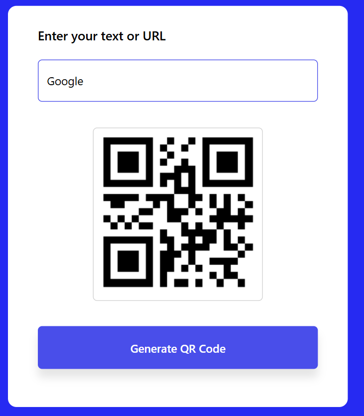

# 🔳 QR Code Generator

A simple and responsive **QR Code Generator** built using **HTML, CSS, and JavaScript**.
This application allows users to generate QR codes instantly from any **text or URL** using a QR Code API.

---

## 🚀 Features

* Generate QR codes instantly
* Supports both text and URLs
* Clean and simple user interface
* Fast QR generation using API
* Responsive design

---

## 🛠 Tech Stack

* **HTML** – Structure of the application
* **CSS** – Styling and layout
* **JavaScript** – Functionality and API integration
* **QR Code API** – Used to generate QR codes dynamically

---

## 📸 Screenshot

---

## 📂 Project Structure

QR-CODE
│
├── index.html
├── style.css
├── script.js
├── qr-code.png
└── README.md

---

## ⚡ How to Use

1. Enter any **text or URL** in the input field.
2. Click on the **Generate QR Code** button.
3. The QR code will be generated instantly.
4. Scan the QR code using your mobile device.

---

## 👩‍💻 Author

**Priya**
Aspiring Software Developer
Currently learning **Java (DSA) and Web Development**
